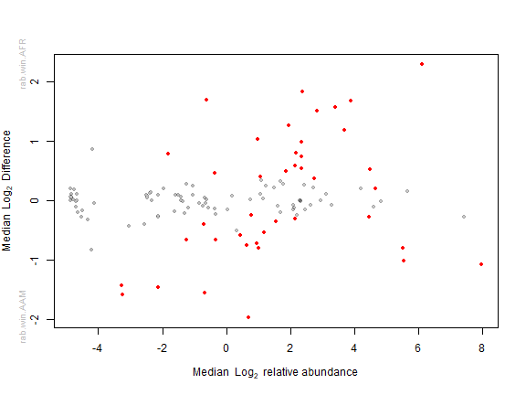
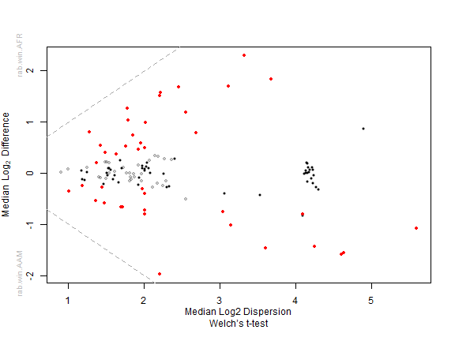
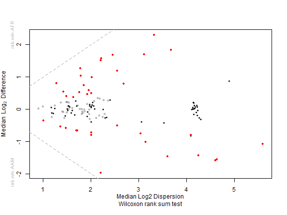
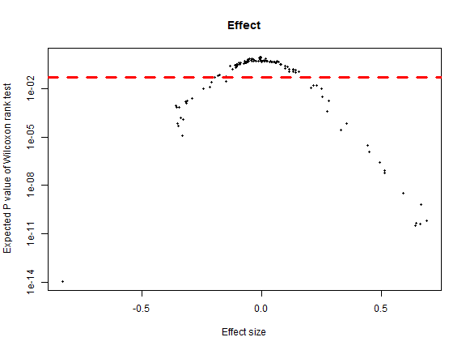
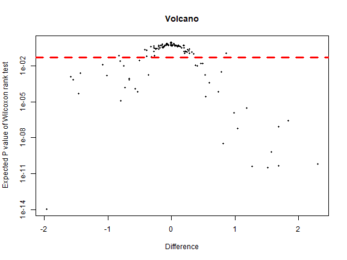

# Installing ALDEx2
ALDEx2 is a bioconductor package that could be installed Via bioconductor


```r
library(BiocManager)
```

```
## Warning: package 'BiocManager' was built under R version 4.0.5
```

```
## Bioconductor version 3.12 (BiocManager 1.30.16), R 4.0.4 (2021-02-15)
```

```
## Bioconductor version '3.12' is out-of-date; the current release version '3.14' is available
##   with R version '4.1'; see https://bioconductor.org/install
```

```r
#BiocManager::install('ALDEx2')
```


# ALDEx2 tutorials
### Main tutorial

[Click](https://www.bioconductor.org/packages/release/bioc/manuals/ALDEx2/man/ALDEx2.pdf)

### ALDEx2 uses non-parametric statistical modeling

[Click](https://www.ncbi.nlm.nih.gov/pmc/articles/PMC6052553/pdf/12859_2018_Article_2261.pdf)


### Useful book

[Statistical Analysis of Microbiome Data with R](https://link.springer.com/book/10.1007/978-981-13-1534-3)


# Working with ALDEx2

### Dataset dietswap

* **Phyloseq dataset**
From microbiome package [dietswap](https://www.nature.com/articles/ncomms7342)


```r
library(microbiome)
data("dietswap")
dietswap
```

```
phyloseq-class experiment-level object
otu_table()   OTU Table:         [ 130 taxa and 222 samples ]
sample_data() Sample Data:       [ 222 samples by 8 sample variables ]
tax_table()   Taxonomy Table:    [ 130 taxa by 3 taxonomic ranks ]
```


* check the number of genera 130
* check the number of samples 222


* The **two groups of interest** in our Aldex2 analysis are:

* AAM, it means African American

* AFR, it means African

* The whole variables of dietswap dataset are: subject, sex, nationality, group, sample, timepoint, timepoint.within.group, bmi_group

### Main tests


#### **t-test** 

T-test between groups where wi.eBH<= 0.05 and we.eBH <= 0.05. The first tens only.


|                                 |    wi.eBH|    we.eBH|
|:--------------------------------|---------:|---------:|
|Allistipes et rel.               | 0.0000000| 0.0000000|
|Anaerostipes caccae et rel.      | 0.0003744| 0.0018104|
|Bacteroides fragilis et rel.     | 0.0000241| 0.0000103|
|Bacteroides intestinalis et rel. | 0.0000010| 0.0000041|
|Bacteroides ovatus et rel.       | 0.0000000| 0.0000000|
|Bacteroides plebeius et rel.     | 0.0000000| 0.0000000|
|Bacteroides splachnicus et rel.  | 0.0001574| 0.0062408|
|Bacteroides stercoris et rel.    | 0.0000007| 0.0000566|
|Bacteroides uniformis et rel.    | 0.0000031| 0.0000007|
|Bacteroides vulgatus et rel.     | 0.0000000| 0.0000000|

#### **Kruskal-Wallis test** 
Kruskal-Wallis test between groups where kw.eBH <=0.05. The first tens only.


|                                 |    kw.eBH|    kw.ep|
|:--------------------------------|---------:|--------:|
|Allistipes et rel.               | 0.0000000| 0.00e+00|
|Anaerostipes caccae et rel.      | 0.0003744| 6.49e-05|
|Bacteroides fragilis et rel.     | 0.0000241| 2.90e-06|
|Bacteroides intestinalis et rel. | 0.0000010| 1.00e-07|
|Bacteroides ovatus et rel.       | 0.0000000| 0.00e+00|
|Bacteroides plebeius et rel.     | 0.0000000| 0.00e+00|
|Bacteroides splachnicus et rel.  | 0.0001574| 2.57e-05|
|Bacteroides stercoris et rel.    | 0.0000007| 1.00e-07|
|Bacteroides uniformis et rel.    | 0.0000031| 3.00e-07|
|Bacteroides vulgatus et rel.     | 0.0000000| 0.00e+00|

#### **Estimate Effect Size** 

Estimate Effect Size between groups where the effect > 0.1 or the effect < -0.1, the first tens only.


|                                  |    rab.all| rab.win.AAM| rab.win.AFR|   diff.btw| diff.win|     effect|   overlap|
|:---------------------------------|----------:|-----------:|-----------:|----------:|--------:|----------:|---------:|
|Allistipes et rel.                |  3.8821443|   3.1735620|   5.1184987|  1.6827081| 2.452606|  0.6453815| 0.2420000|
|Anaerostipes caccae et rel.       |  2.3627786|   1.8639334|   2.8068559|  0.7339510| 1.851319|  0.3554769| 0.3465307|
|Anaerotruncus colihominis et rel. |  2.2013489|   2.4149097|   1.9053185| -0.2462945| 2.253222| -0.1027078| 0.4554000|
|Anaerovorax odorimutans et rel.   |  0.7911510|   0.8953782|   0.6772027| -0.2371923| 1.179151| -0.1951360| 0.4181164|
|Bacteroides fragilis et rel.      |  3.6885093|   2.7178004|   4.4270382|  1.1813630| 2.553975|  0.4447036| 0.3208000|
|Bacteroides intestinalis et rel.  | -0.6084511|  -1.2466604|   0.3607363|  1.6887539| 3.113110|  0.5161131| 0.2680000|
|Bacteroides ovatus et rel.        |  2.8371942|   2.0463266|   3.8891071|  1.5170165| 2.207398|  0.6437112| 0.2380000|
|Bacteroides plebeius et rel.      |  1.9353184|   1.2497308|   2.6040655|  1.2683230| 1.775320|  0.6626469| 0.2376000|
|Bacteroides splachnicus et rel.   |  2.3412498|   2.0846198|   2.6277898|  0.5397633| 1.426762|  0.3314885| 0.3273345|
|Bacteroides stercoris et rel.     |  0.9661823|   0.4116346|   1.5999021|  1.0385431| 1.791394|  0.5145497| 0.2742000|


#### Summary

The first 15 only.


|                                  |   diff.btw| diff.win|     effect|   overlap|     we.ep|     wi.ep|    we.eBH|    wi.eBH|
|:---------------------------------|----------:|--------:|----------:|---------:|---------:|---------:|---------:|---------:|
|Allistipes et rel.                |  1.6827081| 2.452606|  0.6453815| 0.2420000| 0.0000000| 0.0000000| 0.0000000| 0.0000000|
|Anaerostipes caccae et rel.       |  0.7339510| 1.851319|  0.3554769| 0.3465307| 0.0003515| 0.0000649| 0.0018104| 0.0003744|
|Anaerovorax odorimutans et rel.   | -0.2371923| 1.179151| -0.1951360| 0.4181164| 0.0211141| 0.0480160| 0.0561041| 0.1127381|
|Bacteroides fragilis et rel.      |  1.1813630| 2.553975|  0.4447036| 0.3208000| 0.0000011| 0.0000029| 0.0000103| 0.0000241|
|Bacteroides intestinalis et rel.  |  1.6887539| 3.113110|  0.5161131| 0.2680000| 0.0000005| 0.0000001| 0.0000041| 0.0000010|
|Bacteroides ovatus et rel.        |  1.5170165| 2.207398|  0.6437112| 0.2380000| 0.0000000| 0.0000000| 0.0000000| 0.0000000|
|Bacteroides plebeius et rel.      |  1.2683230| 1.775320|  0.6626469| 0.2376000| 0.0000000| 0.0000000| 0.0000000| 0.0000000|
|Bacteroides splachnicus et rel.   |  0.5397633| 1.426762|  0.3314885| 0.3273345| 0.0014504| 0.0000257| 0.0062408| 0.0001574|
|Bacteroides stercoris et rel.     |  1.0385431| 1.791394|  0.5145497| 0.2742000| 0.0000088| 0.0000001| 0.0000566| 0.0000007|
|Bacteroides uniformis et rel.     |  1.8369706| 3.679579|  0.4957472| 0.2997401| 0.0000000| 0.0000003| 0.0000007| 0.0000031|
|Bacteroides vulgatus et rel.      |  2.3023941| 3.325342|  0.6917722| 0.2460000| 0.0000000| 0.0000000| 0.0000000| 0.0000000|
|Bifidobacterium                   |  0.5926565| 1.958753|  0.2756728| 0.3603279| 0.0033633| 0.0004020| 0.0130064| 0.0019153|
|Bryantella formatexigens et rel.  |  0.3721510| 1.631651|  0.2066547| 0.3999200| 0.0139047| 0.0107564| 0.0427792| 0.0353427|
|Bulleidia moorei et rel.          | -0.6617752| 1.690534| -0.3581022| 0.3314000| 0.0002685| 0.0008362| 0.0010634| 0.0028976|
|Catenibacterium mitsuokai et rel. | -1.4600491| 3.606869| -0.3481046| 0.3190000| 0.0003297| 0.0000500| 0.0013848| 0.0002668|


### ALDEx2 Wrapper

The first 15 only.


|                                  |    rab.all| rab.win.AAM| rab.win.AFR|   diff.btw| diff.win|     effect|   overlap|     we.ep|    we.eBH|     wi.ep|    wi.eBH|
|:---------------------------------|----------:|-----------:|-----------:|----------:|--------:|----------:|---------:|---------:|---------:|---------:|---------:|
|Actinomycetaceae                  | -5.4204363|  -5.4092945|  -5.4321770| -0.0166045| 4.295951| -0.0032158| 0.4981004| 0.5408825| 0.6662468| 0.5593549| 0.6835917|
|Aeromonas                         | -5.6428793|  -5.6758291|  -5.5982036|  0.0999227| 4.273076|  0.0199579| 0.4902000| 0.4734196| 0.5949133| 0.4733283| 0.5996132|
|Akkermansia                       |  1.6756814|   1.5516850|   1.8267406|  0.3179851| 2.419060|  0.1153176| 0.4400000| 0.2003383| 0.3612810| 0.1523603| 0.3022648|
|Alcaligenes faecalis et rel.      | -2.0126526|  -2.1321340|  -1.8537325|  0.3086032| 2.506740|  0.1073021| 0.4456000| 0.1396982| 0.2573825| 0.2119747| 0.3422337|
|Allistipes et rel.                |  3.1685258|   2.4628243|   4.4089727|  1.6863310| 2.534544|  0.6334536| 0.2508000| 0.0000000| 0.0000000| 0.0000000| 0.0000000|
|Anaerobiospirillum                | -5.6357331|  -5.6613190|  -5.5982744|  0.1292149| 4.290141|  0.0254937| 0.4858000| 0.4799351| 0.6053111| 0.4710718| 0.6006806|
|Anaerofustis                      | -5.5289517|  -5.6514708|  -5.3843818|  0.2500630| 4.184007|  0.0530279| 0.4749050| 0.4652335| 0.5833427| 0.4226920| 0.5514094|
|Anaerostipes caccae et rel.       |  1.5984067|   1.1735349|   2.0588438|  0.7360688| 1.749802|  0.3796462| 0.3353329| 0.0002153| 0.0011741| 0.0000592| 0.0003574|
|Anaerotruncus colihominis et rel. |  1.4782430|   1.6488056|   1.2145448| -0.2253541| 2.248187| -0.0994275| 0.4542000| 0.4005318| 0.5737620| 0.2617691| 0.4347830|
|Anaerovorax odorimutans et rel.   |  0.0484834|   0.1677666|  -0.0931241| -0.2577202| 1.199850| -0.1994889| 0.4093181| 0.0231633| 0.0596374| 0.0354754| 0.0871158|
|Aquabacterium                     | -5.3244592|  -5.2244056|  -5.4304211| -0.2888279| 4.265327| -0.0594702| 0.4710000| 0.4512127| 0.5760735| 0.4427159| 0.5702740|
|Atopobium                         | -5.2426894|  -5.1749493|  -5.3299428| -0.2197108| 4.222947| -0.0422696| 0.4781044| 0.4387814| 0.5658681| 0.4679078| 0.5962964|
|Bacillus                          | -3.2343323|  -3.2676776|  -3.1969062|  0.0481531| 2.100688|  0.0209229| 0.4904000| 0.5038080| 0.6250387| 0.4856620| 0.6112073|
|Bacteroides fragilis et rel.      |  2.8961119|   1.9943489|   3.6888628|  1.1872371| 2.646289|  0.4283629| 0.3228000| 0.0000037| 0.0000331| 0.0000085| 0.0000686|
|Bacteroides intestinalis et rel.  | -1.3439777|  -1.9823548|  -0.3567300|  1.6874625| 3.139508|  0.5091203| 0.2762000| 0.0000003| 0.0000033| 0.0000002| 0.0000021|


# Plots 

### Bland-Altman plot





* Red taxa are the significant ones with adjusted p-values cutoff 0.05 or less.

* Grey taxa are the rare ones

### Median plots  

Plot median between-group difference Versus median within-group difference



### Effect and Volcano plots


